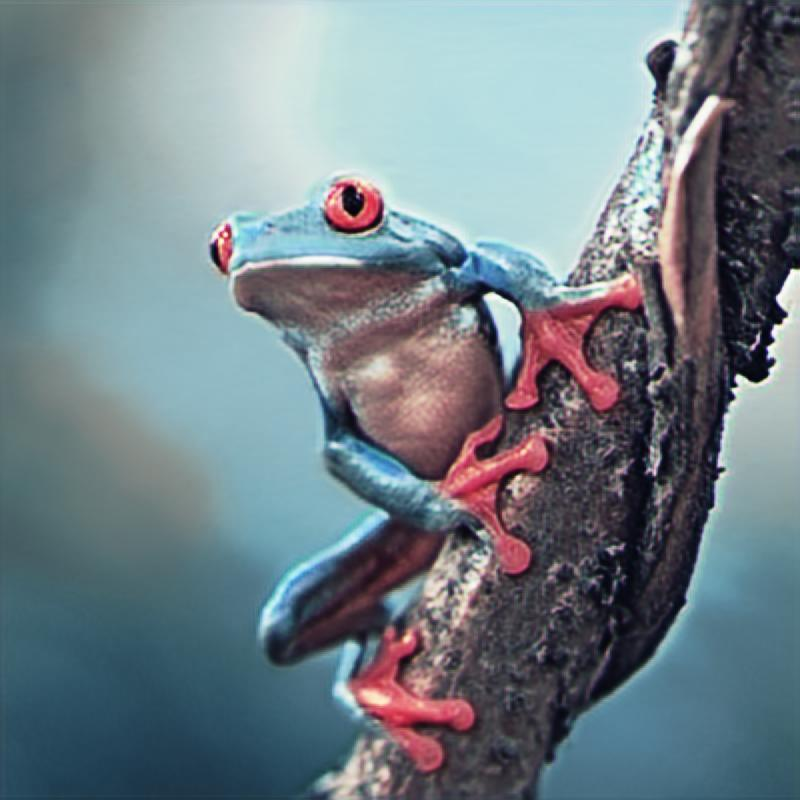
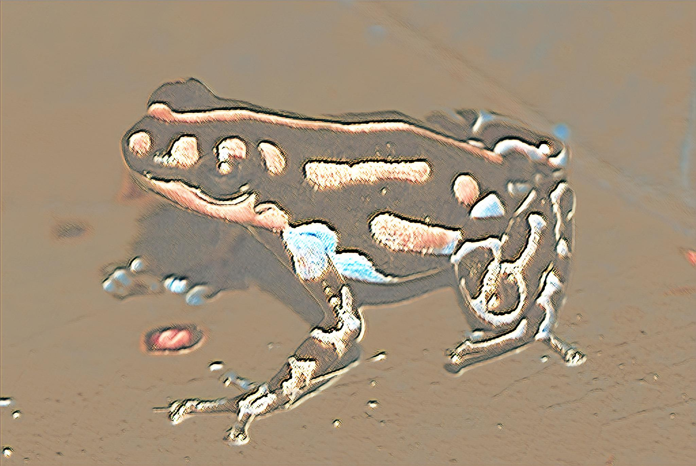

# Perceptual Loss Style Transfer

PyTorch implementation of neural style transfer with configurable VGG-based perceptual loss, multiple model architectures, and an interactive visualization tool.

<div>


</div>

## Features

- **Multiple Model Architectures**: Small, medium, and large ResNet-inspired transformers
- **Configurable VGG Feat Extractor**: Standard, weighted, shallow, or deep layer configurations
- **Interactive Visualization**: Web-based VGG activation explorer with Dash
- **Progressive Training**: Multi-stage curricula with dynamic resolution and batch sizes
- **Multi-GPU Support**: CUDA, MPS (Apple Silicon), and CPU with auto-detection
- **ONNX Export**: Deploy models in ONNX format

## Installation

1. Clone the repository:
   ```bash
   git clone <repository-url>
   cd perceptual-style-transfer
   ```

2. Install dependencies:
   ```bash
   pip install torch torchvision pillow dash plotly
   ```

## Usage

### Quick Start

1. **Train a model**: Configure settings in `style_transfer/config.py` and run:
   ```bash
   python build.py
   ```

2. **Apply style transfer**: Set model and image paths in `apply_style.py` and run:
   ```bash
   python apply_style.py
   ```

3. **Visualize VGG activations**: Launch interactive web interface:
   ```bash
   python visualize.py
   ```

4. **Export to ONNX**: Convert models for deployment:
   ```bash
   python convert_to_onnx.py
   ```

## Project Structure

- `style_transfer/` - Core implementation (training, loss, models, config)
- `utils/` - Metrics and visualization utilities  
- `models/` - Trained models and checkpoints
- `images/` - Content and style image collections
- `outputs/` - Generated stylized images

## Configuration

**VGG Layer Presets**: Choose from `standard`, `standard_weighted`, `shallow`, or `deep` configurations for different style transfer strategies.

**Training**: Supports multi-stage progressive training with configurable resolution, batch sizes, learning rates, and style weights.

**Technologies**: PyTorch, Dash/Plotly, ONNX export, multi-GPU support (CUDA/MPS/CPU).

## License

This project is licensed under the [MIT License](LICENSE).
