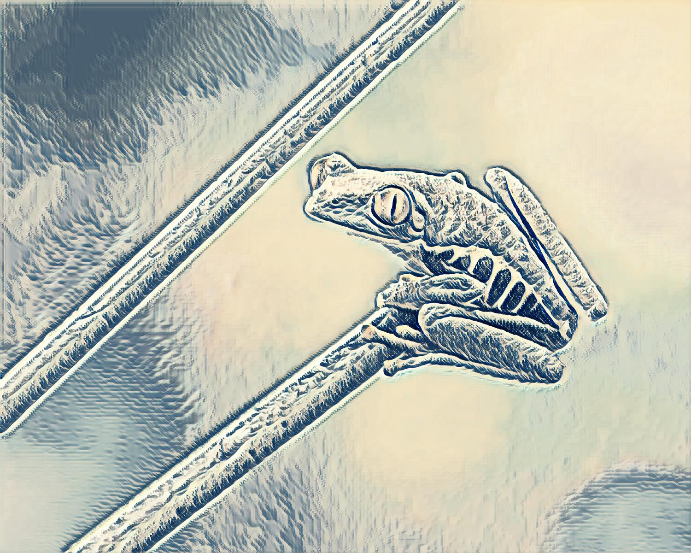

# Perceptual Loss Style Transfer

Created By - J. Blackburn [DEMO WEBSITE](https://style-transfer-demo-75243.web.app/)

Last Updated: Oct 21 2025

---

**Transfer Learning** approach to **Neural Style Transfer** based on [Johnson Et. Al](https://arxiv.org/abs/1603.08155), which uses "percetual loss" calculated from features extracted from a pretrained classification model (VGG19) rather than per-pixel loss. 

<div>


</div>
<sub><sup>This red-eyed tree frog is now styled like the famous "Wave of Kanagawa"</sup></sub>

--- 

This project builds on the original work, offering an easy to use experimentation workspace and supporting features beyond the original scope such as multi-image style datasets, as well as a [DEMO WEBSITE](https://style-transfer-demo-75243.web.app/), built with a <b>FastAPI</b> backend, where you can stylize your own images:

Additionally, the project includes a visualization tool for viewing activations from the feature extractor to inform experiments with different extraction patterns / weights, for the purpose of fine-tuning a particular style

---
## Installation

```bash
git clone <repository-url>
cd perceptual-style-transfer
pip install torch torchvision pillow dash plotly
```

---
## Usage

- Model Training & Inference

1. define your style experiments in style_transfer/config/styles (see kanagawa.py for example)

2. run the experimentation script:
```bash
python3 run_experiment.py
```

---

- Utils

1. **Visualize VGG activations**: Launch interactive web interface:
   ```bash
   python visualize.py
   ```

2. **Export to ONNX**: Convert trained models for deployment:
   ```bash
   python convert_to_onnx.py
   ```

>
> **Output**: Trained models saved to `models/{experiment_name}/`, stylized images in `outputs/{experiment_name}/`

## Project Structure

```
style_transfer/          # Core implementation
├── config/              # Modular configuration system
│   ├── styles/          # Style-specific experiment definitions
│   ├── curricula.py     # Training schedules and hyperparameters
│   └── layer_presets.py # VGG layer configurations
├── feature_extractors/  # VGG and other feature extraction modules
└── architectures/       # Model architecture components

utils/                   # Metrics and visualization utilities
models/                  # Trained models and checkpoints
images/                  # Content and style image collections
outputs/                 # Generated stylized images
```

## Configuration

## License

This project is licensed under the [MIT License](LICENSE).
