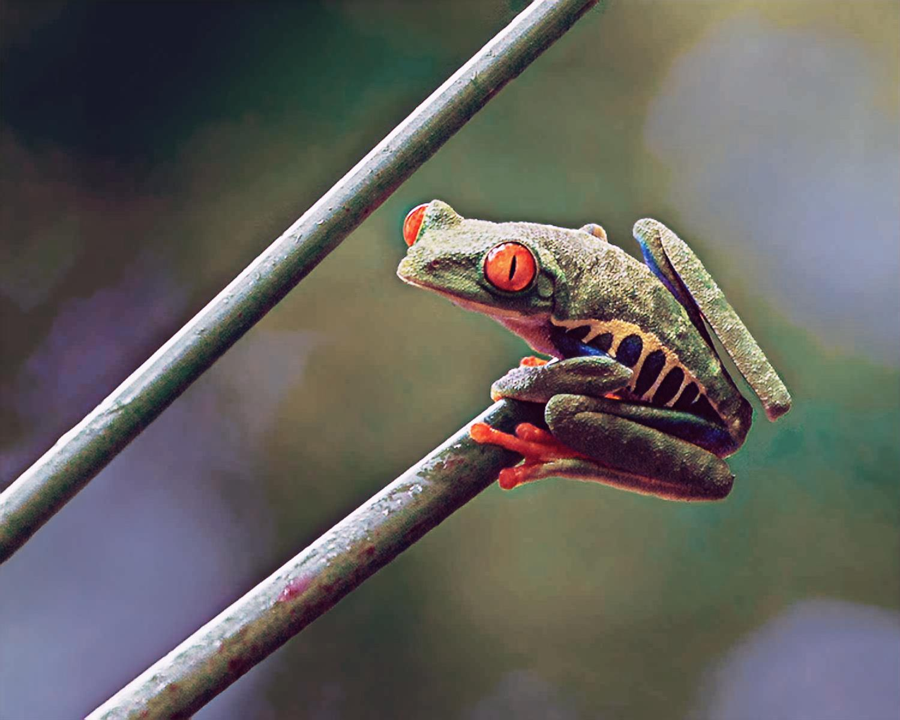
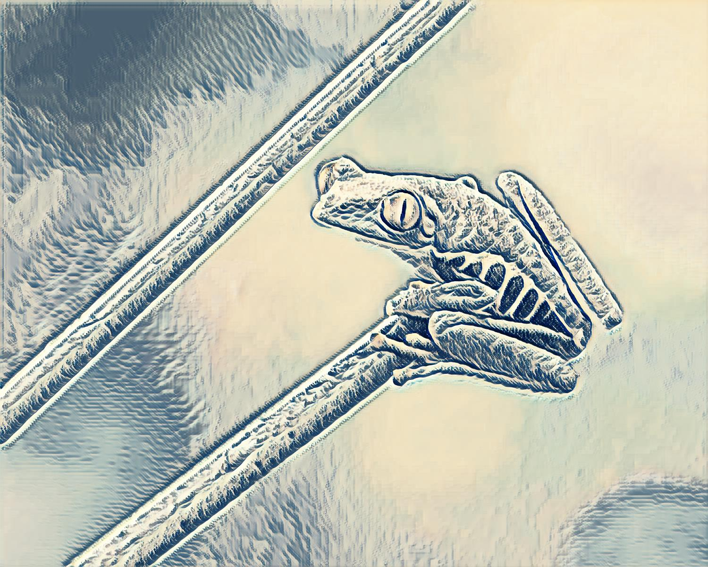

# Perceptual Loss Style Transfer

Created By - J. Blackburn

Last Updated: Oct 3 2026

---

**Transfer Learning** approach to **Neural Style Transfer** based on [Johnson Et. Al](https://arxiv.org/abs/1603.08155), which uses "perceptual loss" calculated from features extracted from a pretrained classification model (VGG19) rather than per-pixel loss. 

<div>


</div>
<sub><sup>This red-eyed tree frog is now styled like the famous "Wave of Kanagawa"</sup></sub>

---

This project builds on the original work with a config-driven experimentation workspace, support for multi-image style datasets, one command line tool for training and stylizing, and a small web UI that runs only on your own machine (localhost).

It also includes a visualization tool for viewing activations from the feature extractor, to inform experiments with different extraction layers / weights when tuning a particular style.

Trained weights are not in this repository: you train them or bring your own.

---
## Installation

```bash
git clone <repository-url>
cd <repository-directory>
pip install -e .            # the style-transfer command
pip install -e '.[ui]'      # plus the local web UI
```

Other optional groups: `viz` (activation visualizer), `export` (ONNX), `research` (diffusion experiments, notebooks), `dev` (tests).

---
## Usage

```bash
style-transfer list
style-transfer train --experiment mini_kanagawa
style-transfer stylize photo.jpg --model mini_kanagawa -o styled.png
style-transfer stylize photos/ --model mini_kanagawa --output-dir styled/
style-transfer serve
```

`python -m style_transfer` is the same command.

- `list` shows the installed models and the training experiments you can run.
- `train --experiment NAME` trains an experiment defined in `style_transfer/config/styles/` (see `kanagawa.py` for an example) and saves it as a model called `NAME`. Training needs the content and style images the experiment names, which are not in the repository.
- `stylize` writes an image the same size as its input. A file needs `-o` (the extension sets the format); a directory needs `--output-dir` and writes `<stem>.png` for each jpg/jpeg/png in it. Existing files are not replaced without `--overwrite`. `--max-side N` downsizes large inputs first, `--limit N` caps a directory run, `--device cpu|cuda|mps` overrides device detection.
- `serve [--port 8000]` starts the web UI at `http://127.0.0.1:8000`. It listens on localhost only and needs the `ui` extra.

### Models

A model is a folder in the models directory, `artifacts/models` under the current directory by default (`--models-dir PATH`, given before the subcommand, changes it):

```
artifacts/models/
└── mini_kanagawa/
    ├── mini_kanagawa.pth    # weights
    └── model.json           # name, model_size, weights file, how it was trained
```

Only folders containing a `model.json` count as models. Training writes it. `stylize` and `serve` take the architecture size from it, never from the experiment config, so a model keeps working when the config changes. The required keys are `name`, `model_size` (`small`, `medium` or `big`) and `weights`.

For weights trained before `model.json` existed, put them at `<models-dir>/<name>/<name>.pth` and generate the file from the experiment of the same name:

```bash
python scripts/write_model_json.py mini_kanagawa mini_colors1 mini_colors2 high_starry_night
```

### Utilities

1. **Visualize VGG activations** (needs `pip install -e '.[viz]'`):
   ```bash
   python -m style_transfer.utils.visualize
   ```

2. **Export to ONNX** (needs `pip install -e '.[export]'`):
   ```bash
   python -m style_transfer.utils.convert_to_onnx
   ```

## Project Structure

```
style_transfer/          # Core library and command line tool
├── cli.py               # The style-transfer command
├── inference.py         # Model lookup and stylize_image, the one inference path
├── train.py             # Training loop
├── loss.py              # Perceptual loss
├── models.py            # Generator network
├── config/              # Experiment definitions
│   ├── styles/          # Style-specific experiment definitions
│   ├── curricula.py     # Training schedules and hyperparameters
│   └── layer_presets.py # VGG layer configurations
├── feature_extractors/  # VGG feature extraction
├── architectures/       # Model architecture components
└── utils/               # Visualization, ONNX export, metrics

style_transfer_web/      # Local web UI (style-transfer serve)
diffuser/                # Diffusion-based style transfer experiments
scripts/                 # One-off maintenance scripts
tests/                   # pytest suite
artifacts/examples/      # Example styled images
artifacts/models/        # Trained models (not in the repository)
```

## Configuration

Style experiments are defined in `style_transfer/config/styles/`. Each one specifies the style images, VGG layer extraction pattern, loss weights, and training curriculum.

## License

This project is licensed under the [MIT License](LICENSE).
